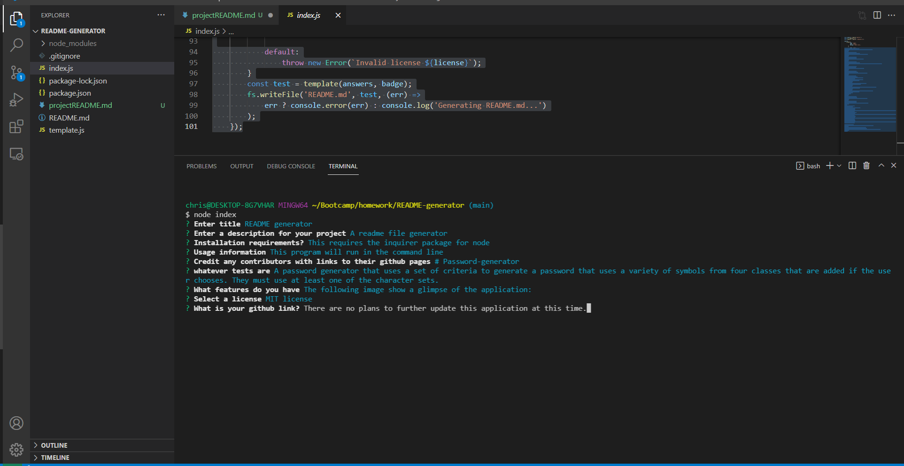

# README.md generator

## Description

A node.js file that lets a user generate a readme file automatically using a series of prompts.

## [Try it yourself!]

The following image show a glimpse of the application:

## Getting Started

This is a simple application that runs right in the browser, no installation or downloads needed.

## Built With:

Node.js

## Author:

Chris Muto

## Planned Updates

There are no plans to further update this application at this time.